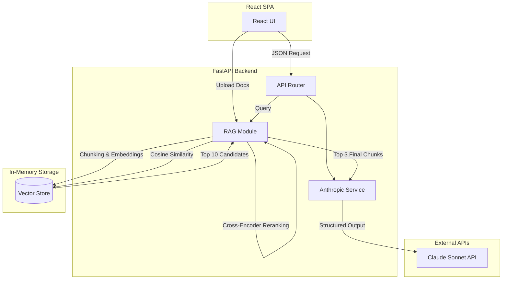

# ClarityDesk

## What We Built

### 1. Robust FastAPI Backend
The core backend is structured exactly as requested, separating concerns for a production-ready RAG pipeline:
- **`backend/main.py`**: The entry point mounting all API routes (`/api/process-notes`, `/api/summarize-email`, `/api/documents`, `/api/ask`).
- **`backend/services/anthropic_service.py`**: Handles strict Pydantic JSON parsing with exactly 1 retry fallback loop, logging `tokensUsed` and `estimatedCost` locally to `cost_log.jsonl`.
- **`backend/prompts/`**: Houses prompt logic away from route definitions (`notes.py`, `email.py`, `qa.py`).
- **`backend/models/`**: Houses all Pydantic schemas.

### 2. Retrieval-Augmented Knowledge Assistant
A local, memory-based semantic search layer powered by `sentence-transformers`:
- **`backend/rag/chunking.py`**: Extracts text from `.txt`, `.docx`, and `.pdf`, splitting them into ~500-word chunks while capturing page numbers.
- **`backend/rag/embeddings.py`**: Uses `all-MiniLM-L6-v2` to generate vector embeddings.
- **`backend/rag/retrieval.py`**: Performs Cosine Similarity against the in-memory array.
- **Citation Format**: Correctly formats citations with exact source text snippets for high-trust answers.
  ```text
  The grant submission deadline is April 1 and Jose is responsible.

  source: sample_meeting_notes.txt · chunk 2

  matched text:
  "Jose will reach out to the Hartley Foundation by this Friday to confirm the April 1 grant submission deadline."
  ```

### 3. Vite + React Frontend
A clean SPA using the "organized desk" aesthetic (`#0F6E56` primary, Inter font):
- **Notes Processor (`NotesPanel.tsx`)**: Accepts messy notes, renders a clean table of tasks, owners, and deadlines, and supports 1-click CSV export.
- **Email Summarizer (`SummarizePanel.tsx`)**: Extracts summaries, urgency, and action items.
- **Q&A Assistant (`AskPanel.tsx`)**: Handles document upload and semantic questioning with citation rendering.

### 4. Advanced Retrieval Pipeline (Phase 4.5)
The Q&A layer is implemented as a multi-stage `retrieval → reranking → generation` pipeline for maximum precision:
1. **Embedding**: `all-MiniLM-L6-v2` encodes the user question.
2. **Cosine Similarity (Recall@10)**: Fast vector search retrieves the top 10 broad candidates.
3. **Cross-Encoder Re-Ranking**: `cross-encoder/ms-marco-MiniLM-L-6-v2` re-evaluates the 10 candidates against the exact question context to surface the 3 most highly relevant chunks.
4. **Generation**: Claude uses the top 3 chunks for zero-hallucination answers.

### 5. Evaluation Harness
An automated testing suite located in `evaluation/eval.py`.
It tests:
1. Action item extraction accuracy (Expecting exactly 5 items from the sample notes).
2. Missing owner handling ("Unassigned") and missing deadlines (`null`).
3. Hallucination prevention ("I couldn't find this" for out-of-scope questions).
4. Citation format stringency.
5. Latency tracking.
6. **Retrieval Recall@10**: Verifies the target chunk is found in the initial top 10 search.
7. **Re-Ranking Improvement**: Validates that the Cross-Encoder pushes the target chunk closer to position #1.

> [!TIP]
> **Running the Evaluator**
> Add your Anthropic API key to `backend/.env`.
> Activate the backend virtual environment: `cd backend && .\venv\Scripts\activate`
> Run the harness: `python ../evaluation/eval.py`
> Metrics and timestamped reports will be automatically saved in `evaluation/reports/`.

## System Diagram


